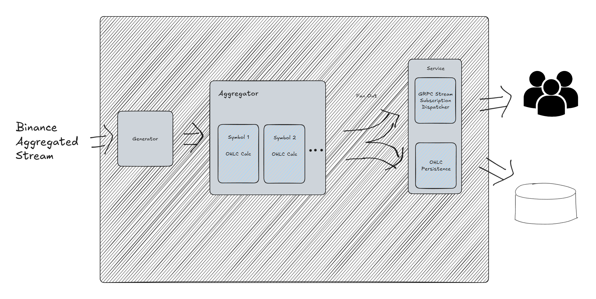

# trading-chat-aggr
A gRPC service that aggregate trade stream into OHCL chart

## HowTos

This project using make and makefile as its build system.

### Init

To init the development environment run 
```
make init
make tidy
```

### protobuf

Buf is chosen as protobuf toolchain, a throw-away container will be run on executing protobuf related make commands, docker is required in order to generate code locally.

To generate client and server side code from protobuf, use
```
make pbgen
```

It also supports linting
```
make pblint
```

### DB

#### Migration

It is required to prepare migration files before updating database schema.

To generate migration files
```
make mgrt-prep MGRT_NAME="MyMigration"
```
Both up and down files generated at `sql/migrations`

After that, run command to migrate db schema, golang-migrate will run files in order, only nearest migration will be ran.
```
make mgrt DB_URI="uri" MGRT_DIRECTION=up|down

```

See: [migrate/MIGRATIONS.md at master · golang-migrate/migrate](https://github.com/golang-migrate/migrate/blob/master/MIGRATIONS.md)

#### Compile sql to query API

To ensure type-safe for the code, sqlc is used to generate queries API code from SQL.

```
make dbgen # Compile sql to type-safe code
```

See: [sqlc Documentation — sqlc 1.28.0 documentation](https://docs.sqlc.dev/en/latest/)

### Test

Golang standard Test
```
make test
```

### Run locally
```
make server DB_URI="uri"
```

### More

More commands can be found by
```
make help
```
## Design 

In order to maximize performance, server use goroutine for paralleling tasks. So call pipeline fan out to handle IO-Intensive operations, while using single-thread to handle trading data aggregation.



- Use binance combine stream to save bandwidth
- Single goroutine handle data aggregation, modern CPU can handle those task with ease
- Isolate DB IO and gRPC stream if service running stand-alone, by fan out two goroutines to handle separately 
- Modules interact together via channel, loose couple design enables flexibility for scaling


### What's next

- As official docs point out binance stream's longest time of connection is 24 hour, a piece of code that reconnects it seamlessly will be ideal
- Error handling at binance stream error is needed, the code for reconnecting can be reused, ideally design will be activating two streams (primary and secondary), secondary stream will be reconnected every 6 hour, switching stream to secondary when primary falls
- Covering OHLC chart auditing when trading data is not arriving in order
- Refine gRPC stream
- Considering switching from postgrasql to time-series database for performance improvement
